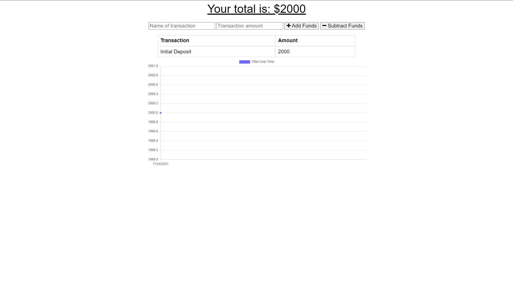

# Offline-Budget-Tracker
  [](https://opensource.org/licenses/MIT)


   


  ## Description:
  This is a progressive budget tracker.  It can track your budget on or offline.

  ## Deployment:

    https://warm-citadel-12423.herokuapp.com/

    https://github.com/Chris-Franklin-1701/Offline-Budget-Tracker

  ## Installation:
  ``` md git clone to your repo ```
  

  ## Contribution:
  Please contribute to fork

  ## Resources:
  Unit Extensions: unit 19
  
  ## License:
  MIT
  https://opensource.org/licenses/MIT

  ## Contact:
  https://christopherfranklin.dev/

  https://github.com/Chris-Franklin-1701
  
  CFrank306@gmail.com

